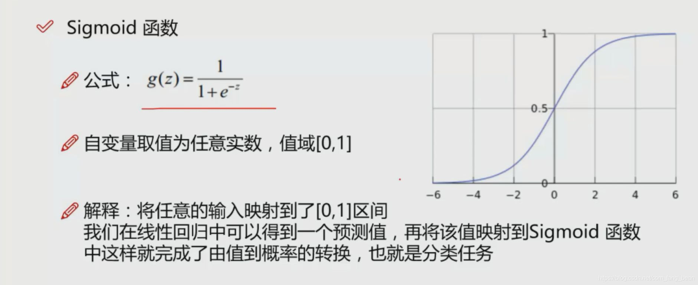
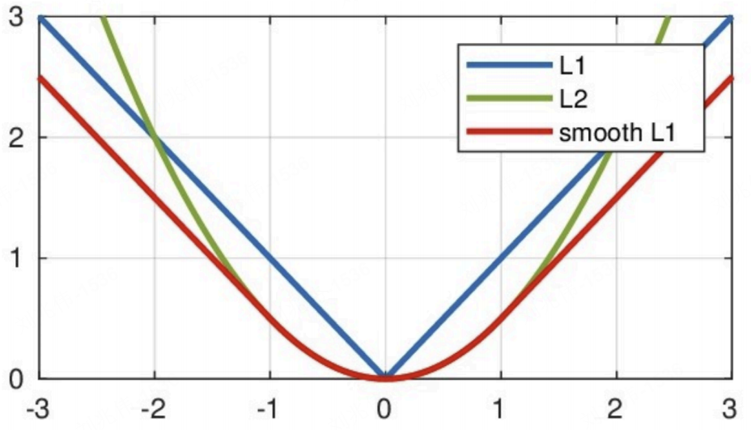
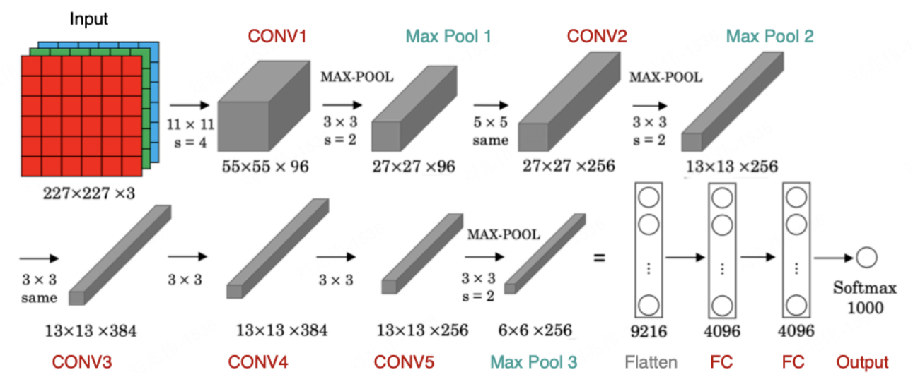

# 大模型学习笔记

## 一些网站

- https://www.naftaliharris.com/blog/visualizing-dbscan-clustering/
- [模型查看](https://netron.app/)

## 核心概念

### 池化（Pooling）

池化（Pooling）是卷积神经网络（CNN）中的一种 **降采样（Downsampling）操作** ，用于 **压缩特征图的尺寸** ，同时保留重要信息。它通过对局部区域（如 2×2 或 3×3）进行聚合计算（如取最大值、平均值），减少数据量，降低计算复杂度，同时增强模型的鲁棒性。

**池化的作用**

**1. 降维（减少计算量）**

* 池化通过缩小特征图的尺寸（高度和宽度），减少后续层的参数数量和计算量。
* 例如：
  * 输入：`4×4` 特征图 → 最大池化（2×2，stride=2）→ 输出：`2×2` 特征图。
  * 计算量从 `4×4=16` 降到 `2×2=4`，减少了 75%。

**2. 防止过拟合**

* 池化减少了模型参数数量，降低了过拟合风险（类似于正则化）。
* 例如，AlexNet 使用 **最大池化** 来增强泛化能力。

**3. 增强特征鲁棒性**

* 池化对局部区域进行聚合，使模型对微小平移、旋转、缩放等变化更鲁棒。
  * **最大池化（Max Pooling）**：保留最显著的特征（如边缘、纹理），增强模型的判别能力。
  * **平均池化（Average Pooling）**：平滑特征，减少噪声影响。

**4. 提取主要特征**

* 池化相当于一种“注意力机制”，聚焦于局部区域的最重要信息（如最大值），忽略次要细节。

### 损失函数（**Loss Function）**

* **定义**：
  损失函数衡量单个样本的预测值与真实值之间的差异。它是模型在**单个数据点**上的误差度量。
* **特点**：
  * 通常用于描述模型在某个具体样本上的表现。
  * 例如：均方误差（MSE）、交叉熵损失（Cross-Entropy Loss）、Hinge Loss 等。

### **代价函数（Cost Function）**

* **定义**：
  代价函数是 **所有样本损失函数的平均值或总和** ，用于衡量整个训练集上的模型性能。
* **特点**：
  * 是损失函数的聚合形式，通常用于优化过程（如梯度下降）。
  * 有时与“损失函数”混用，但严格来说，代价函数更关注全局（整个数据集）。

## 常用函数

### sigmoid

### Softmax 激活函数

#### 1. **数学定义**

Softmax 函数将一组输入值转换为概率分布，公式为：

$$
Softmax(z_i) = \frac{e^{z_i}}{\sum_{j=1}^k e^{z_i}}
$$

其中：

* $z_i$ 是第 **i** 个神经元的输入值。
* K 是类别总数。
* 输出为 **K** 个概率值，总和为 1。

#### 2. **特点**

* **输出范围**：每个输出值在 (0, 1) 之间，且所有输出之和为 1。
* **多分类适用**：将分数（logits）转换为概率分布。
* **归一化**：通过指数运算放大差异，再归一化。
* **数值稳定性**：实际实现中常用以下技巧避免数值溢出：$Softmax(z_i) = \frac{e^{z_i - max(z)}}{\sum_{j=1}^k e^{z_i - max(z)}}$ 其中 **max**(**z**) 是 **z** 中的最大值。

#### 3. **应用场景**

* **多分类问题**：输出层使用 Softmax 处理多个类别（如手写数字识别：0~9）。
* **交叉熵损失**：与 Softmax 配合使用时，交叉熵损失函数可简化为：
  $$
  L = - \sum_{i=1}^K y_ilog(\hat{y_i})
  $$
* 是真实标签（one-hot 编码），$ \hat{y_i}$ 是 Softmax 输出。

#### 4. **优缺点**

* **优点**：
  * 直接输出概率分布，适合多分类任务。
  * 概率解释性强（如“类别 A 的概率是 70%”）。
* **缺点**：
  * 对输入值较大或较小时敏感（可通过数值稳定技巧缓解）。
  * 计算复杂度略高于 Sigmoid（需计算指数和归一化）。

### MAE损失

#### 1. **定义**

MAE 计算预测值与真实值之间 **绝对误差的平均值** ，公式为：

$$
MAE = \frac{1}{n} \sum_{i=1}^n \lvert y_i - \hat{y_i} \rvert
$$

其中：

* **y**i：第 **i** 个样本的真实值。
* $ \hat{y_i}$：第 **i** 个样本的预测值。
* **n**：样本数量。

#### 2. **特点**

* **对异常值的鲁棒性**：
  MAE 对离群值（异常值）不敏感，因为绝对误差不会放大大的误差（不像 MSE 会平方）。
* **梯度恒定**：
  在优化时，MAE 的梯度始终为 ±1（方向取决于误差正负），可能导致收敛速度较慢（缺乏自适应学习率）。
* **解释性强**：
  输出值直接表示平均误差的绝对大小（如 "平均误差为 0.5"）。

#### 3. **适用场景**

* 数据中存在较多异常值时（如房价预测中的极端高价房）。
* 需要更稳定的梯度更新时（避免 MSE 的梯度爆炸问题）。

### MSE损失

#### 1. **定义**

MSE 计算预测值与真实值之间 **平方误差的平均值** ，公式为：

$$
MSE = \frac{1}{n} \sum_{i=1}^n ( y_i - \hat{y_i} )^2
$$

#### 2. **特点**

* **对异常值敏感**：
  平方操作会放大大的误差（如误差为 5 时，MSE 贡献 25，而 MAE 仅贡献 5），因此对异常值更敏感。
* **梯度非线性**：
  梯度与误差成正比$ (\frac{\partial MSE}{\partial \hat{y}} = 2(y-\hat{y}))$，优化时可能更快收敛（但需注意学习率调整）。
* **数学性质好**：
  平方误差是凸函数，易于优化（如梯度下降）。

#### 3. **适用场景**

* 数据分布较均匀且异常值较少时（如标准化后的回归任务）。
* 需要快速收敛且对异常值不敏感的场景。

### smoothL1损失

$$
smooth_{L_1}(x) = 
\begin{cases}
0.5x^2, & \text{if } |x| < 1 \\
|x| - 0.5, & \text{otherwise}
\end{cases}
$$

## 网络模型

### AlexNet

#### 网络结构

AlexNet主要由5个卷积层、3个池化层和3个全连接层（2个全连接隐藏层 + 1个全连接输出层）组成，具体结构如下：

1. **输入层**：接受227x227x3（RGB图像）大小的图像作为输入。原始数据为224x224x3，经过预处理变为227x227x3，这样设计是为了使卷积操作后的特征图尺寸计算更合理，利于计算和更多信息的保留。
2. **卷积层**：
   * **第一卷积层**：使用96个大小为11×11的卷积核，步长为4，使用3×3内核和步幅2执行最大池化。该层用于提取图像的低级特征。
   * **第二卷积层**：有256个大小为5x5的卷积核，padding = 2，然后进行最大池化操作。此层进一步提取特征。
   * **第三、四、五卷积层**：分别采用384、384和256个3×3的卷积核，每个卷积核的步长为1。这些层用于提取更高级的特征。
3. **池化层**：在卷积层之后，使用最大池化（Max Pooling）操作，窗口大小通常为3x3，步长为2，以降低特征图的维度，减少计算量，并防止过拟合。
4. **全连接层**：
   * **第一全连接层**：包含4096个神经元。
   * **第二全连接层**：同样包含4096个神经元。
   * **输出层**：有1000个神经元，对应ImageNet数据集的1000个类别，通过Softmax函数将预测值转换为概率分布。

### VGGNet

#### 网络结构

### GoogLeNet
